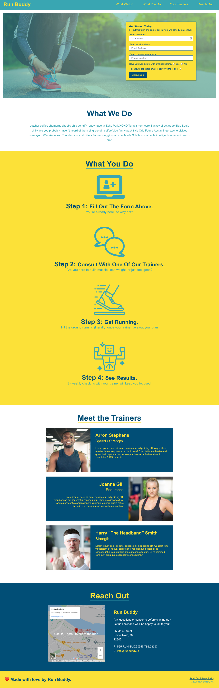
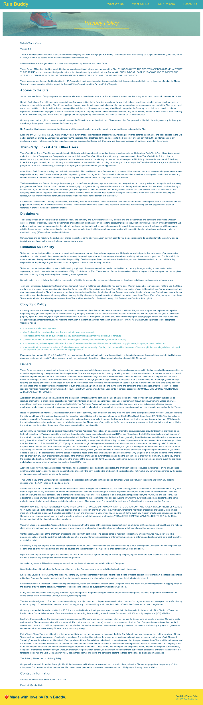

# Run-buddy, Inc.

## Purpose
The following project (home page & privacy policy) was created through a HTML and CSS tutorial through Vanderbilt's Full-Stack Web Development coding bootcamp. This home page and it's secondary page serve as a website for a mock fitness training company.

## Built With
* HTML
* CSS

## Description
* Interacted with the computer's file system by using the command line.

* Created an HTML document in VS Code.

* Applied meaning, context, and functionality to HTML elements by using HTML attributes.

* Interpreted a mock-up given to us by designers by dividing it into sections, or containers, to create organized HTML content.

* Used Git to create a repository for the project and create reassuring save points throughout the build process.

* Used GitHub to create a remote location for the repository, and then published the project to GitHub Pages for others to see.

* Applied style and layout to HTML content by using CSS, syntax, rules, and quirks.

* Used the knowledge gained from building the Run Buddy landing page to create a Privacy Policy page.

## Website
https://joshacross.github.io/run-buddy/

## Contribution
Made with ❤️ by Joshua Cross

## Reference Images

